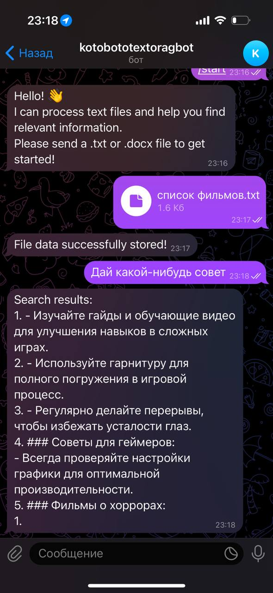

# Чат-бот на основе Retrieval-Augmented Generation (RAG)

Этот проект представляет собой чат-бота, использующего технологию Retrieval-Augmented Generation (RAG) для работы с документами пользователей. Система интегрирует векторную базу данных (например, ChromaDB) для поиска релевантной информации, извлечения сущностей из текста и выдачи рекомендаций на основе содержания документов.

---

## Требования

- Python 3.8 или выше
- Docker и Docker Compose

---

## Установка

1. **Клонирование репозитория**

```bash
git clone https://github.com/eshelukhina/UXTextsHWBot
cd UXTextsHWBot
```

2. **Установка зависимостей (только для локальной работы)**

```bash
pip install -r src/requirements.txt
python3 -m spacy download en_core_web_sm
```

При использовании Docker все зависимости будут установлены автоматически при сборке контейнера.

---

## Настройка

Перед запуском необходимо указать токен для вашего Telegram-бота:

- **BOT_TOKEN**: Получите токен через Telegram.

Добавьте токен в файл `.env`:

```
BOT_TOKEN=ваш_токен
```

---

## Запуск через Docker

1. Для запуска с Docker Compose:

```bash
docker-compose up --build
```

Это создаст и запустит контейнеры с необходимыми компонентами.

---

## Запуск без Docker

1. Настройте окружение и запустите приложение:

```bash
source .env
cd src
python3 app.py
```

---

## Основные компоненты

- **`docker-compose.yml`**: Конфигурация контейнеров Docker.
- **`Dockerfile`**: Описание процесса сборки Docker-образа.
- **`scripts/run.sh`**: Скрипт для запуска приложения.
- **`src/app.py`**: Основной скрипт с логикой обработки запросов и рекомендаций.
- **`src/requirements.txt`**: Зависимости Python для проекта.

---

## Примечания

- Убедитесь в правильности токена `BOT_TOKEN`.
- В случае ошибок с API Telegram, проверьте настройки токена и подключения.

---

**Тестовый бот** доступен по ссылке: [@kotobototextoragbot](https://t.me/kotobototextoragbot)

